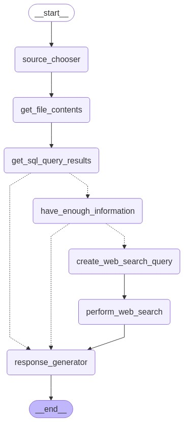

# Multi-Source AI Agent Challenge

Solution to the hiring challenge of curling ai:

[CHALENGE_README](CHALLENGE_README)

## Overview

This solution implements an intelligent AI agent capable of answering user questions by intelligently selecting and querying multiple data sources: SQLite databases, local documents, and external web content via bash commands.  
It uses:

- **Express** for the backend server and API handling
- **LangChain** and **LangGraph** for the agent logic
- **Svelte** for a modern, interactive frontend interface

---

## Agent Execution Graph

The agent follows the following process to answer the user's question



If web searching is not allowed the agent moves from the `get_sql_query_results` directly to the `response_generator`,
else it analyses if more information is necessary and, if necessary, generate and perform web searches.

To perform a web search the AI creates querys that are used in the search engine duckduckgo trough the bash command 

```bash
curl -s -L "https://duckduckgo.com/html/?q=the+generated+query"`
```

then the algorithm fetchs the link of the first result and executes the bash command 
```bash
curl -L -s "https://first-result-link"
```

---

## Project Structure

```
# The espress backend is in the main directory
/frontend    # Svelte app for user interaction
/data        
  /sqlite    # SQLite database files
  /documents # Text documents
.env         # Environment variables
```

---

## Setup Instructions

### 1. Clone the repository

```bash
git clone https://github.com/Miguel-MCM/hiring-challenge-curling-ai
cd multi-source-ai-agent
```

---

### 2. Setup Backend

```bash
npm install
```

- Create a `.env` file based on `.env.example`.

Start the backend server:

```bash
node index.js
```

By default, it runs on `http://localhost:3000`.

---

### 3. Setup Frontend

```bash
cd ../frontend
npm install
npm run dev
```

This starts the Svelte development server, typically at `http://localhost:5173`, which communicates with the backend API.

---

### 4. Add Sample Data

- Place your SQLite `.db` files into the `/data/sqlite/` directory.
- Place your `.txt` document files into the `/data/documents/` directory.

---

## Using the Application

1. Open the Svelte frontend in your browser.
2. If wanted allow web searches
3. Type a question in the chat interface.
4. The backend agent will:
   - Analyze your question
   - Choose the appropriate data sources (database, document and/or external fetch via bash)
4. You’ll receive a natural language answer!

---

## Example Questions

| Type | Example Question | Expected Behavior |
|:-----|:-----------------|:------------------|
| SQLite | "What music is in most playlists?" | Queries the SQLite database |
| Document | "What is the book The Wealth of Nations About?" | Reads and extracts from `.txt` files |
| Bash Command | "How to bake a cake?" | Executes a web search with `curl` |
| Multi-Source | "What music is in most playlists and what notes does it usew" | Combines SQLite and `curl` web search responses |

---

## Key Features

✅ Intelligent data source routing  
✅ User approval for executing bash commands  
✅ Combined answers from multiple sources  
✅ Simple and fast frontend using Svelte  
✅ Modular, easy-to-extend backend with Express and LangChain  

---

## Environment Variables

Backend expects the following variables in `.env`:

```bash
PORT=3000
GROQ_API_KEY=your-groq-api-key
GROQ_MODEL=desired_model (defaul is llama-3.3-70b-versatile) 
DATA_DIR=./data
```

---

## Future Improvements

- Add authentication and user sessions
- Improve bash command security (sandboxing)
- Add document format support beyond `.txt` (e.g., PDF, DOCX)
- Enhance frontend UX with chat history and loading states

---

## Resources

- [LangChain JS Documentation](https://js.langchain.com/docs/)
- [LangGraph Documentation](https://js.langchain.com/docs/langgraph/)
- [Express Documentation](https://expressjs.com/)
- [Svelte Documentation](https://svelte.dev/)